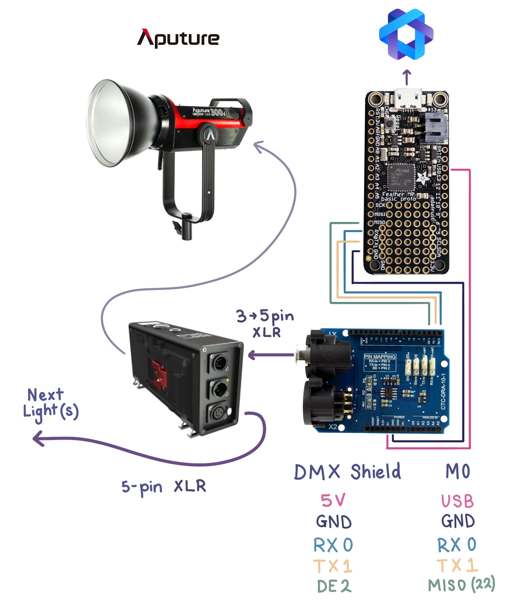
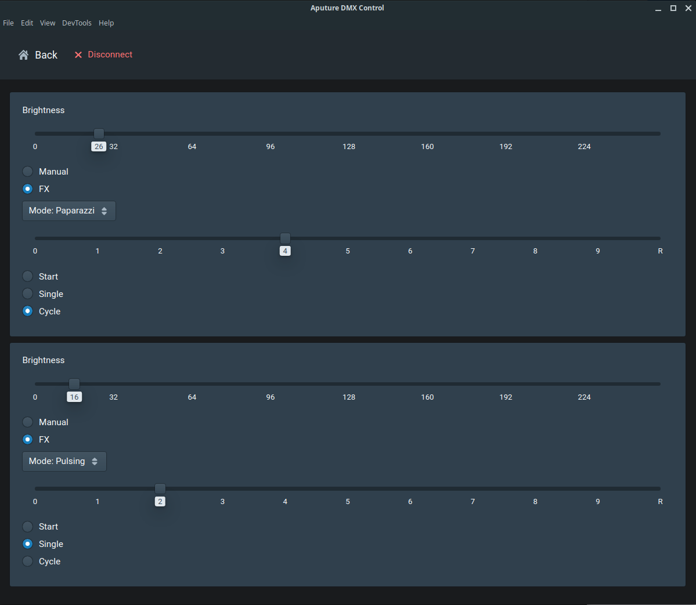

# Control Aputure lights with Arduino via DMX-512
This repo contains the quick and dirty implementation for computer control of some Aputure Lightstorm fixtures (video lights) over DMX.

I use this to control a pair of lights in time-lapse video, allowing smooth brightness ramps across frames as [other systems handle motion etc](https://electricui.com/blog/delta-lightpainting).

## Pre-requisites

- Aputure lighting fixtures which support DMX-512 control ([120DII](https://www.aputure.com/products/ls-120d-ii/) and [300DII](https://www.aputure.com/products/ls-c300d-ii/) used),
- [Adafruit M0 Proto](https://www.adafruit.com/product/2772)
- [DFRobot DMX Shield](https://www.dfrobot.com/product-984.html), I bought mine from [CORE Electronics](https://core-electronics.com.au/dmx-shield.html)

- DMX cables (XLR). I made my own with locally sourced parts.
  - [3-pin XLR to 5-pin XLR cable](https://www.google.com/search?q=3-pin+to+5-pin+dmx),
  - [5-pin XLR to 5-pin XLR cable](https://www.google.com/search?q=5-pin+dmx+cable) if chaining multiple fixtures,

## Wiring



The `DE (pin 2)` control pin can be moved to any GPIO, just ensure the  `SAMD21DMX.setDirectionPin(22);` line in the firmware is updated to match.

## Firmware

I tried using the shield with an Arduino Uno and wasn't satisfied with the quality of the DMX waveform, or the use of timers and the only hardware UART peripheral. 

Additionally, the shield's design intent/recommendation to use 8-bit AVR based Arduino's is not ideal post 2020, as the range/availability and capability of ARM microcontrollers provide a superior prototyping experience. Not needing to swap the enable jumper on the shield each time you program the micro is a great QoL improvement.

Instead, the [`LSXAMD21DMX` library by claudeheintz](https://github.com/claudeheintz/LXSAMD21DMX) was used with the M0 proto.

The firmware also depends on the [`electricui-embedded` library](https://github.com/electricui/electricui-embedded) which handles communication with the PC control interface, or serial commands from another microcontroller.

### Configuring the DMX output

Each fixture requires 5 addresses for control. Use `setMaxSlots` to configure the output range. This was set to a smaller value than the 512 addresses supported, as it increases the output frequency (and reduces memory consumption).

During `setup()`, the calls to `LSXAMD21DMX` are relevant:

```c
SAMD21DMX.setDirectionPin(22);
SAMD21DMX.setMaxSlots(16);
```

### Adding additional fixtures

Fixture abstraction is achieved with the array of `AputureLS_t` structures, where an enum value is used to reference the fixture in the array in a human friendly manner.

Add an additional entry to the `LSFixtureNames` enum to add an additional light.

```c
enum {
    LS_C300D2 = 0,
    LS_120D2,
    LS_NUM_FIXTURES,  // must be last entry in enum
} LSFixtureNames;

AputureLS_t cob_fixtures[ LS_NUM_FIXTURES ] = { 0 };
```

```c
// somewhere in your code
cob_fixtures[LS_C300D2].intensity = 64;
cob_fixtures[LS_120D2].intensity = 128;
```

At the moment, committing the structure to DMX isn't dynamic for n light fixtures, as the fixture's base address isn't dynamically configured.

` commit_aputure_to_dmx( 1, &cob_fixtures[ LS_C300D2 ] );` where `1` is the DMX address of the light.

### Flashing firmware

- Open the `/firmware/firmware.ino` sketch with the Arduino IDE.
- Set the board to `Adafruit M0` and choose the relevant port. [Read this](https://learn.adafruit.com/adafruit-feather-m0-basic-proto/setup) if you need help.
- Click upload.
- The red LED on the M0 should be blinking to indicate operation.

## User Interface

The actual interface is rather simple and was made in about 20 minutes - just slider for brightness control and settings to configure the various inbuilt lighting effects (mode, frequency and start/repeat controls).

The UI will automatically create a control card for each of the number of fixtures configured in firmware.



With [`Electric UI` tooling installed](https://electricui.com/install), from your shell:

- Navigate to `/interface`
- `arc install` to pull the dependancies
- `arc start` to launch the Electron sandbox environment and connect to the M0 over USB.
  - `arc build` will generate a binary bundle for your OS to simplify startup/distribution if needed.

### Editing the UI

The main UI layout as shown in the above screenshot can be found at `/interface/src/application/pages/DevicePages/OverviewPage.tsx`.

The 'fixture structure' and mode enums are defined in `/interface/src/application/typedState.tsx`, and the codec to handle the C-structure conversion is in `/interface/src/transport-manager/config/codecs.tsx` and should be pretty self explanatory.